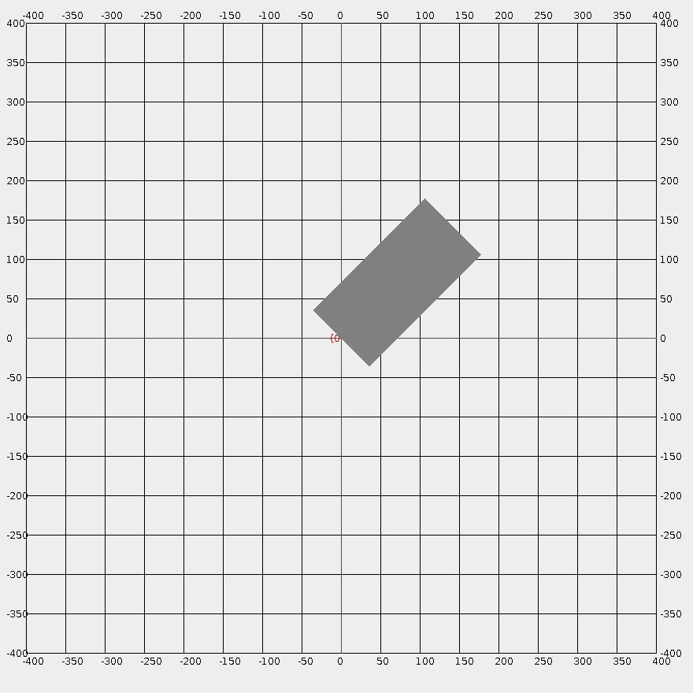
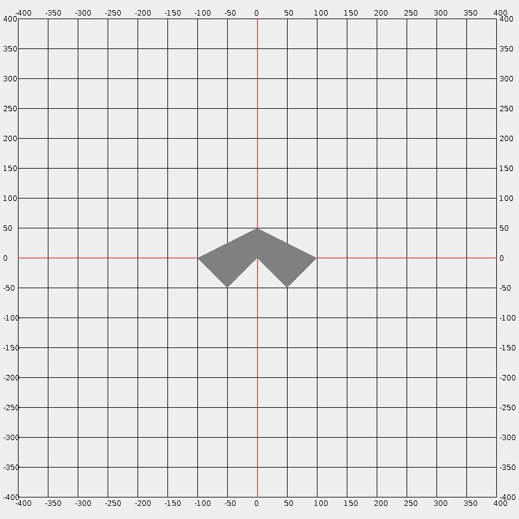
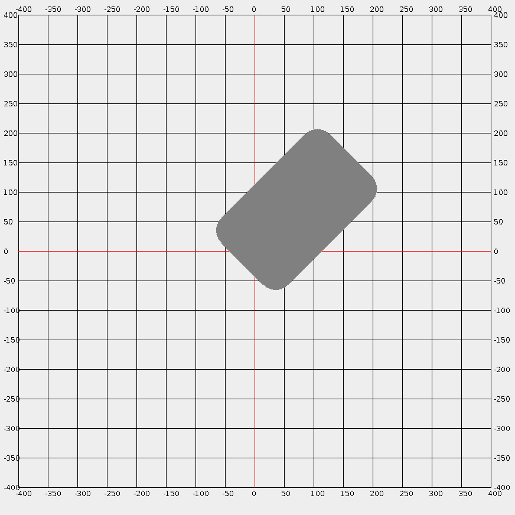

# Geometry

___Implementations of geometry algorithms in Java.___

[![Maven Release][maven-shield]][maven-link]
[![Javadocs][javadoc-shield]][javadoc-link]

## Usage

```java
// Basics
int angle = Angle.getDegrees(0, 0, 100, 100);
System.out.println("Angle.getDegrees: " + angle);

angle = Angle.getAngularDistanceByRotatingCounterclockwise(angle, 0);
System.out.println("Angle.getAngularDistanceByRotatingCounterclockwise: " + angle);

long p = Point.rotateCounterclockwise(0, 0, 100, 100, angle);
System.out.println("Point.rotateCounterclockwise: " + Point.getX(p) + "-" + Point.getY(p));

// Point
boolean b = Point.isInsideCircle(0, 0, 100, 50, 50);
System.out.println("Point.isInsideCircle: " + b);

b = Point.isInsideRectangle(0, 0, 200, 100, 45, 10, 10);
System.out.println("Point.isInsideRectangle: " + b);

b = Point.isInsidePolygon(new int[] {-50, 50, 0}, new int[] {0, 0, 100}, 10, 10);
System.out.println("Point.isInsidePolygon: " + b);

// Circle
b = Circle.intersectsCircle(0, 0, 10, 30, 0, 20);
System.out.println("Circle.intersectsCircle: " + b);

b = Circle.intersectsRectangle(0, 0, 100, 50, 45, 10, 10, 50);
System.out.println("Circle.intersectsRectangle: " + b);

// Polygon
Polygon polygon =
    Polygon.from(new int[] {0, 50, 100, 0, -100, -50}, new int[] {0, -50, 0, 50, 0, -50});
b = polygon.intersectsCircle(0, 0, 45, 0, 0, 10);
System.out.println("Polygon.intersectsCircle: " + b);

// For more details, see APIs, tests and visual demos
```

## Screenshots

Point.isInsideRectangle



Point.isInsidePolygon



Circle.intersectsRectangle



Polygon.intersectsCircle


<!-- references -->

[maven-shield]: https://img.shields.io/maven-central/v/io.ytcode/geometry.png
[maven-link]: https://search.maven.org/search?q=io.ytcode.geometry
[javadoc-shield]: https://www.javadoc.io/badge/io.ytcode/geometry.svg
[javadoc-link]: https://www.javadoc.io/doc/io.ytcode/geometry